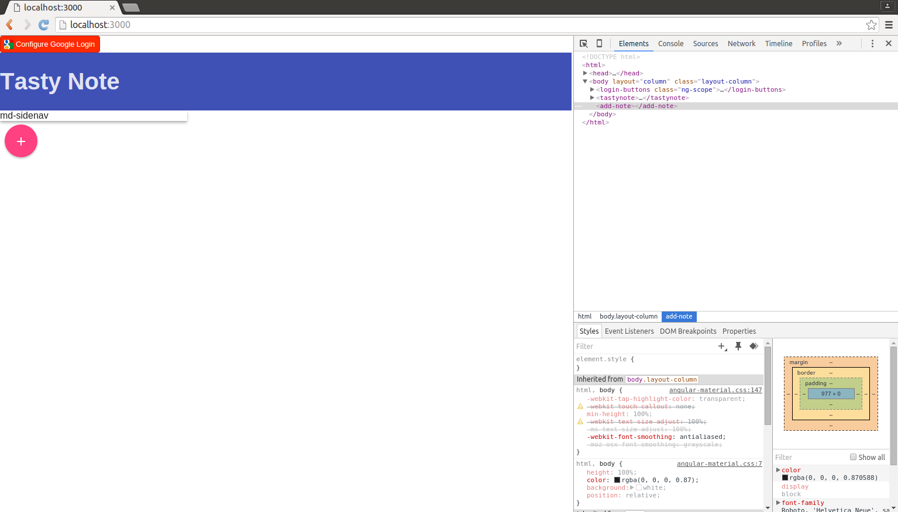
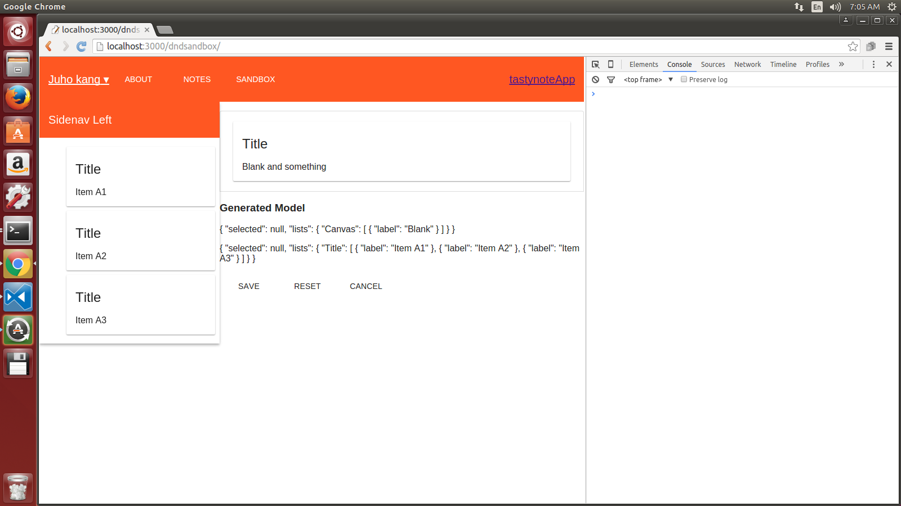
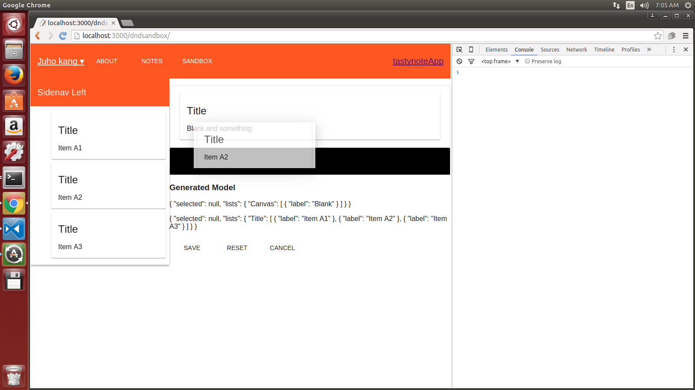
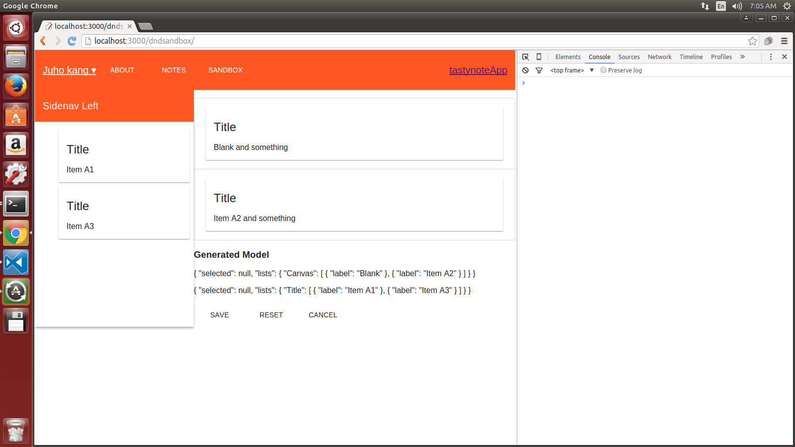

# tastynote-webclient

 

###Intro

* Billion notes for billion people! a note which suits your taste. 
This is the web client application for tastynote. 
We will start with examples, sample codes and build it up till it becomes tasty!

###Features
We can add ,delete find a note. simple login(nothing touched) 

###Currently working

can drag and drop from the side menu.

2. melt google drive api into tastynote --pending
3. make a basic add, delete, edit note -- done a little bit?
4. learn the structure, code from yo generators -- done
5. make concrete plan(layout) for the drag and drop sandbox 

##Problem

* should understand angular more

###Team
Juho Kang 
Taehee Kim

